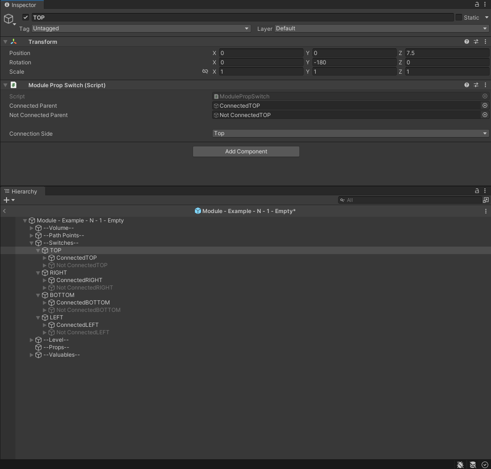
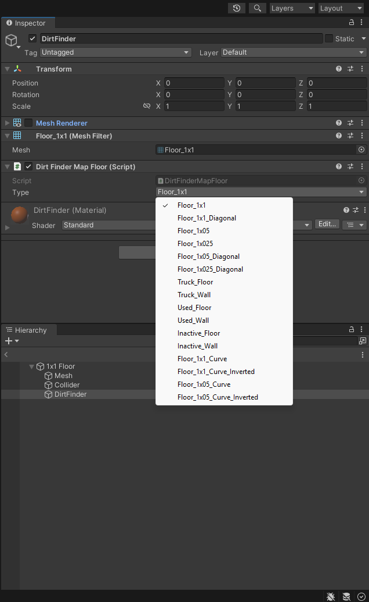
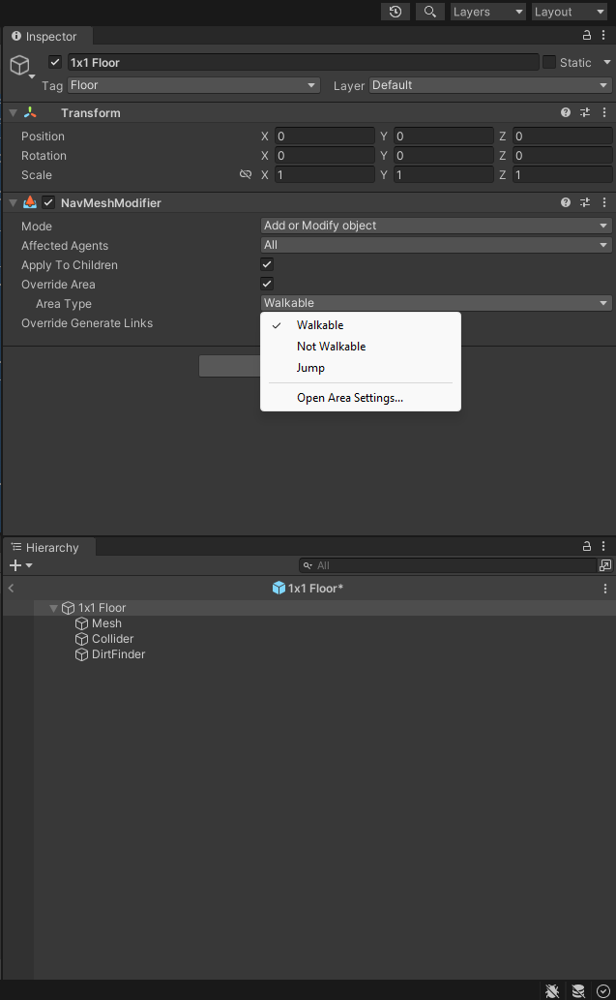

# Creating Levels with REPOLib-Sdk

::: warning NOTICE
This Page is currently Work in Progress!
:::

::: info NOTE
**This guide assumes you have a Unity project set up for REPOLib modding.\
If not, follow [Getting Started](./start.md) first.**
:::

  - The patcher outputs vanilla levels to `Assets/REPO/Game/ScriptableObjects/Level` and their assets to `Assets/REPO/Game/Resources/level`.
- On the `Level` asset, make sure that the `Valuable Presets` list is empty.
  - This will make generic valuables spawn in your level. If you'd like specific valuables to also spawn, see [Proxy Valuable Presets](#proxy-Valuable-Presets).

## Creating a Level object

- Right click in your mod folder and choose `Create > Level > Level Preset` to create a `Level` object. The default name for this will be `Level - _____`. Replace the underscores in the `Level` object with your `Resource` name.
- Fill in the fields:
  - `Resource Path`: A unique name for your level that you'll name all your files after.
  - `Narrative Name`: The actual name that will show up in game and to the players.
  - For this example level, we'll be using:
     - `Resource Path`: Example
     - `Narrative Name`: Example Level
  - `Loading Graphics 01`: The building sprite that the truck crashes in to on the level loading screen.
  - `Loading Graphics 02`: The background sprite for terrain like trees/mountains.
  - `Loading Graphics 03`: The farground sprite for further terrain and the horizon/moon/sun.
  - `Valuable Presets`: The valuables you want to appear in your level, see [Proxy Valuable Presets](#proxy-Valuable-Presets).
  - `Music Preset`: The "music" that can play randomly during the level. For now, let's use a placeholder vanilla one. `Level Music - Arctic (Level Music)`.
  - `Ambience Presets`: The ambient noises that play randomly during the level. For now, let's use a placeholder vanilla one. `Level Ambience - Global (Level Ambience)`.

## Creating a Level Content object

- Right click in your mod folder and choose `Create > REPOLib > Level` to create a `Level Content` object.
Rename this to your `Narrative Name`.
- Fill in the fields:
  - `Level`: Drag your `Level` object into this entry. (`Level - Example`)
  - `Connect Object`: The [door](#doors) prefab that always spawns between connected modules. (Optional)
  - `Block Object`: The prefab that always spawns between unconnected modules. (Optional)

## Modules

- There are 5 kinds of modules (rooms):
  - `Start Room`: Module containing the truck that the players spawn in and the first extraction. These do not have a difficulty level and always spawn exactly 1.
  - `Normal`: Most common modules that contain [Switches](#Switches), and can be connected to on all 4 sides. Has 3 difficulty levels.
  - `Passage`: Always has two entrances. Has 3 difficulty levels.
  - `Dead End`: Rarest module that has a chance to spawn connected to any of the other above modules. Has 3 difficulty levels.
  - `Extraction`: Required modules that contain the extraction point. Has 3 difficulty levels.

- Module Size:
  - The maximum size a vanilla module can be is 3x3. The coordinates being `-7.5, 7.5` (x,z)
  - Anything going over our module size will have a chance to cause overlap in neighboring modules with the exception of `Start Rooms` that can be as large as you'd like.
  - Using this, we know the doorways will always spawn at these coordinates:
  
| Normal Modules |   X   |   Y   |   Z   |
| -------------- | :---: | :---: | :---: |
| Top            |   0   |   0   |  7.5  |
| Right          |  7.5  |   0   |   0   |
| Bottom         |   0   |   x   | -7.5  |
| Left           | -7.5  |   0   |   0   |

| Module Type  |   X   |   Y   |   Z   |
| ------------ | :---: | :---: | :---: |
| Starter Room |   0   |   0   |   0   |
| Dead End     |   0   |   0   | -7.5  |
| Extraction   |   0   |   x   | -7.5  |
| Passage TOP  |   0   |   0   |  7.5  |
| Passage BOT  |   0   |   0   | -7.5  |

## Module Prop Switches

- Module Prop Switches are only used in `Normal` modules and are required. These are what are used to change how a room looks depending on if that side is connected to another module or not.
- Typically we have 4 parents for each side of a module. Each parent should have the `Module Prop Switch` script where you can drag in your `Connected` and `Not Connected` parents respectively and the connection side.

## Level Path Points

- `Level Points` need to be on the [navmesh](#navmesh) and are used by enemies as wander points and general navigation.
- `Level Points` should not be in extraction modules.
- Connected path points need to be correctly connected and referenced to one another on both objects. For example, if `TOP` has a connected point `Middle`. The `Middle` path point should have a connected point to `TOP`.
- To assign path points, click and drag the desired point in to the `Connected Points` field on a `Level Point` object.
- There are two kinds of `Level Points` which are used for enemy navigation. A straight line is drawn from all connected path points and there should be no objects obsctructing that path.
    - `External`: These are marked as `Module Connect` objects and are required on every module type with the exception of Extraction Modules. External path points should NOT be connected to each other, only to `Internal` path points. External path points should be placed near/on these coordinates. 

| External Path Points |   X   |   Y   |   Z   |
| -------------------- | :---: | :---: | :---: |
| Top                  |   0   |   0   |   5   |
| Right                |   5   |   0   |   0   |
| Bottom               |   0   |   x   |  -5   |
| Left                 |  -5   |   0   |   0   |

   - `Internal`: These are optional path points that are not marked as `Module Connect` objects and are used for adding extra navigation within a module, like going around a corner or up stairs.

## DirtFinder

- DirtFinder is the object used to display the map in-game. There are 3 kinds of DirtFinder we use for maps.
  - `Wall`: The dark green lines that outline the floor on the minimap.
  - `Floor`: The lighter green shapes that display the floor on the minimap.
  - `Door`: The white lines on the minimap.
- Each `DirtFinder` type has a subset of different shapes to properly display your physical level to the minimap.

- You can get a better visual aid by assigning your `DirtFinder` object with a `Mesh Filter` and `Mesh Renderer` with the appropriate mesh. Make sure to disable this afterwards or else it will show up in-game.

## Navmesh

- Navmesh is used by the enemies to pathfind between modules.
- `NavMeshModifier` is typically assigned to the parent of your floors/walls which applies the modification to all the colliders in the children.
- In editor, the `NavMesh` will show up as a blue highlight showcasing where enemies are able to have proper navigation on.
- `NavMeshModifiers` have 3 different area types.
  - `Walkable`: Allows navigation on all nested colliders.
  - `Not Walkable`: Overwrites collider navigation and removes walkability.
  - `Jump`: Forces enemies to pathfind by jumping over selected colliders.

- Typically we want to assign, `Walkable` to all our floors and `Not Walkable` to all our walls and any props.

## Room Volume

- `Room Volume` is used for sound logic, as well as displaying the undiscovered rooms on the mini-map.
- `Room Volume` objects should include a `Box Collider` and the `RoomVolume` script as well as be assigned to the, `RoomVolume` layer at the top.
- `Room Volumes` can overlap on each other and should cover the entire walkable area, but should not extend outside of the module size.

## Doors

- Doors are optional prefabs we can use to connect between modules.
- They should be centered on `0, 0` in their prefab.
- For our example, we can copy the, `Manor Door` prefab and reference it to make our own doors.
- To make sure our door fits in our doorways, we want to make sure the `PhysGrabObject` `Collider` is slightly smaller around the edges than the actual door mesh.
- Make sure the collider also has the, `Phys Grab Object` tag and is under the `PhysGrabObjectHinge` layer.
Our collider should also have the, `PhysGrabObject` material assigned.

## Proxy Valuable Presets

To use vanilla `Level Valuables` presets in your levels, you should not simply reference them in the `Level` asset. This is because the bundle will then contain duplicates of all the vanilla valuables from that preset. Instead, you have to create a "proxy" preset:

- Create a `Level Valuables` anywhere in your project by going to `Create > Level > Level Valuable Preset`
- Name the asset exactly as the vanilla one you want to include (see [Create a valuable](#create-a-valuable)).
- Add your newly created preset to `Level Valuables` in your `Level` asset.

At runtime, REPOLib will match the name and replace your proxy with the real thing.
